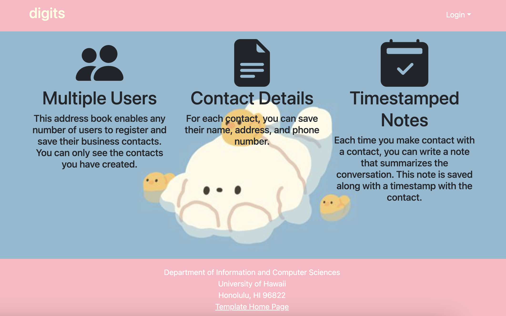
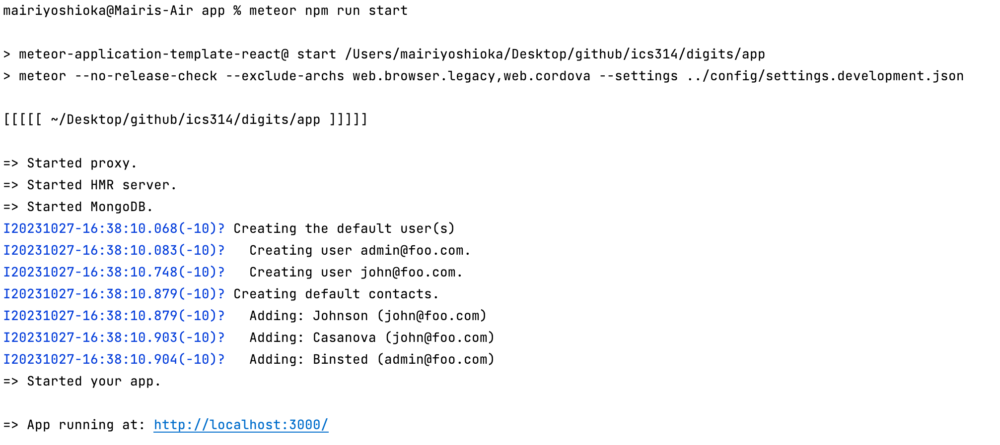
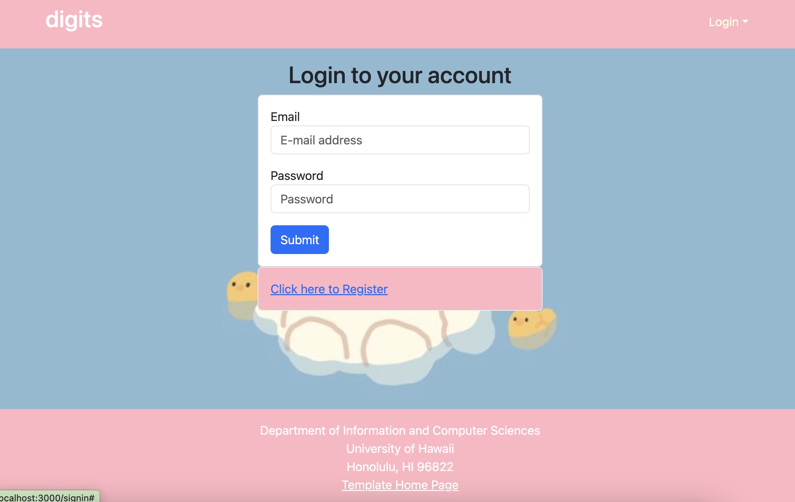
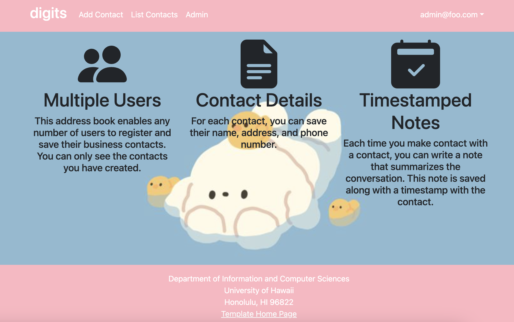
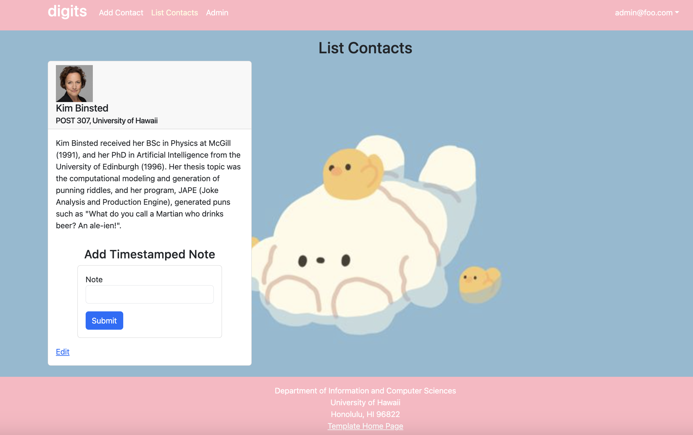
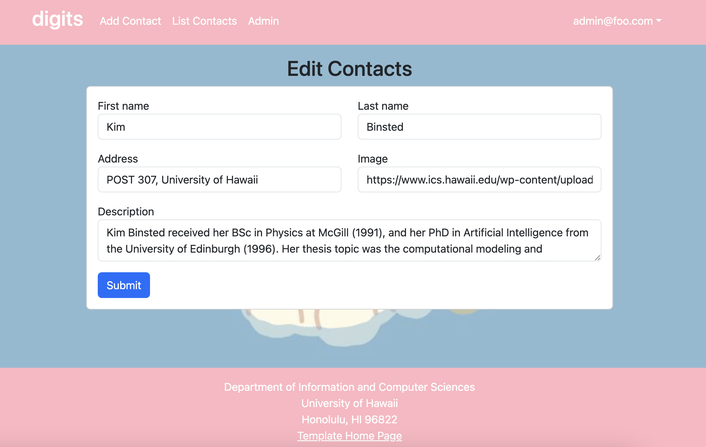
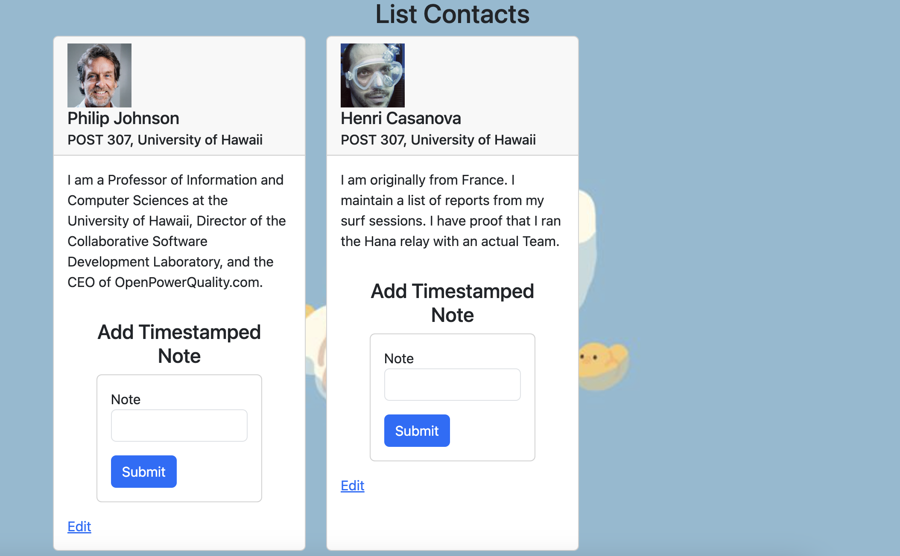
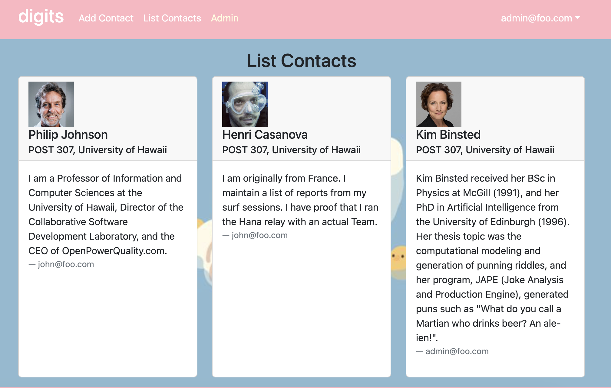

Digits is an simple website application that holds user accounts, contact information, and a timestamped note taking system.

## Installation

First, [install Meteor](https://www.meteor.com/install).

Second, once you have access to the Digits repo you can [download a copy of the project](https://github.com/mair1/digits).

Third, once you have the project set up in a program like IntelliJ IDEA, you can open up the terminal inside the application, cd into the app/ directory and run: 
```
$ meteor npm install
```
Fourth, to actually run the website use: 
```
$ meteor npm run start
```
* This segment might take a while to finish but you will know its done when this pops up: 
* This created the users that you can log into to access certain pages along with the default contacts built into the website
* It also contains the link you can click on to open the website
  
Fifth, as a precautionary check you can run:
```
$ meteor npm run start
```
to see if there are any errors, hopefully there won't be any and you can run the website without any issue

## User Interfaces

### Landing
The page that opens up when you click on the website link is the landing page. This will give users a brief description on what the webstie application is capable of
    

### Login
If you click ont he top right from there and hit sign in you can use the user accounts that already exist to sign in (the password and user emails can be found in config/settings.development.json)


### Home and Navbar
Once you are logged in navbar options will pop up.
* Here I am showing the admin page: 

### Add Contact
Adding contact will prompt the user to add information for someone including their first and last name, address, picture, and also a description of who they are or what they do 

### List Contact
This tab will show all the contacts that are under the user you are logged into 

### Edit Contact
Users can also access the contact information to edit each of the fields if they want to by clicking the edit button on the list contacts page 

### Timestamped Notes
For each contact notes can also be added to document any important information or details related to the person 

### Admin
This admin tab is only available when logged in as admin and shows every contact in the database along with the owner 
